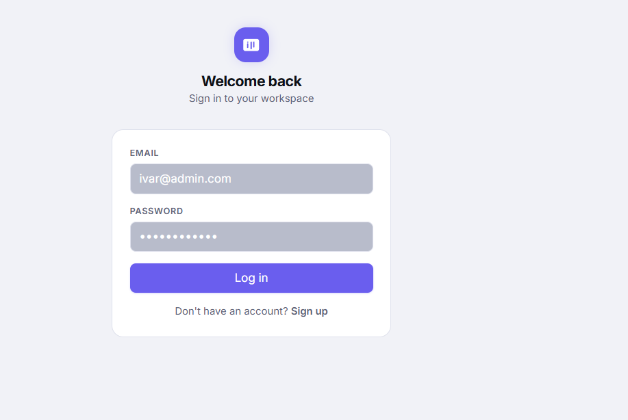
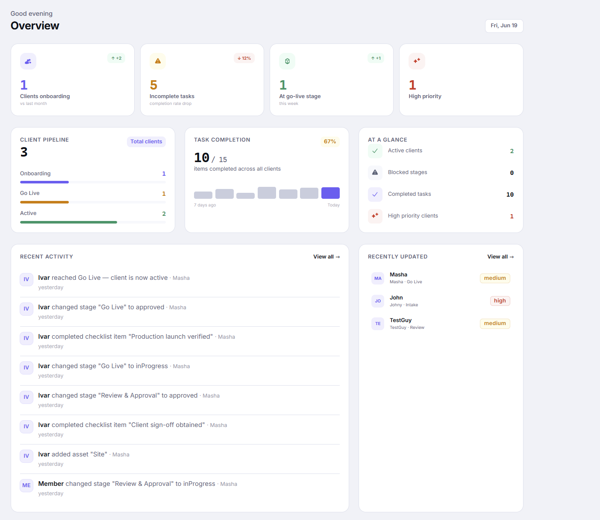
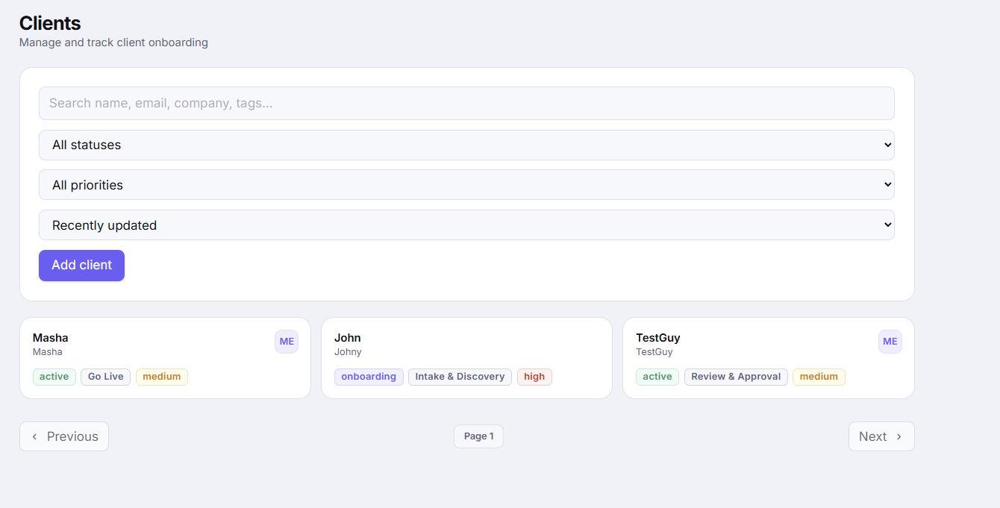
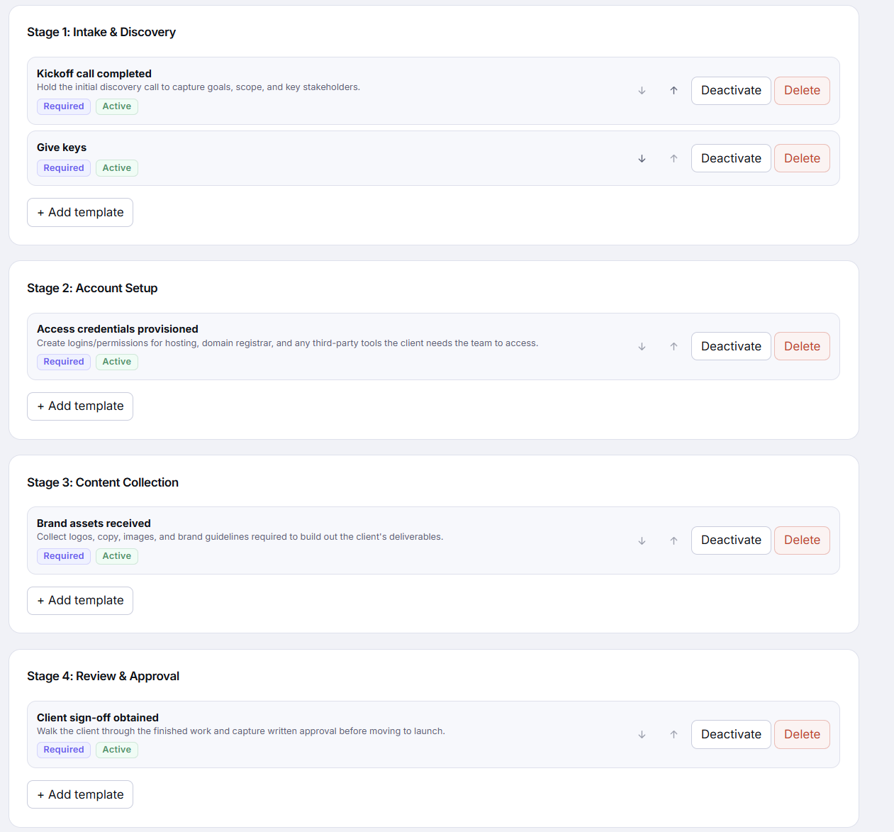
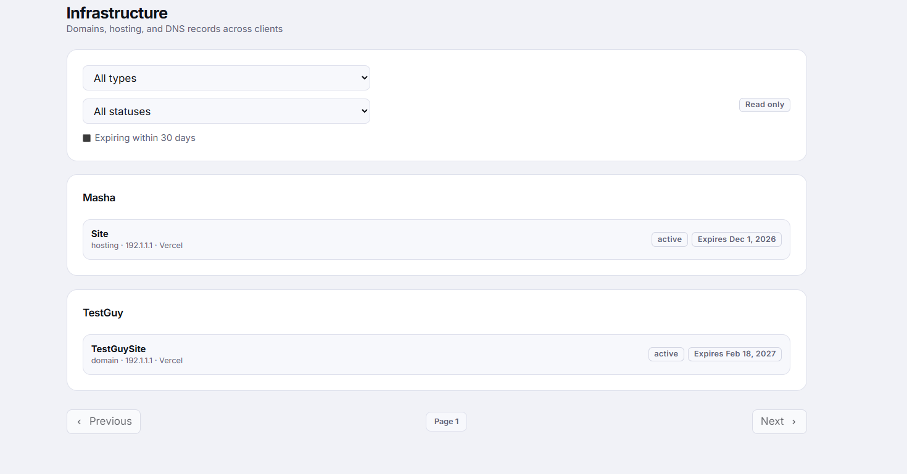

# Client Manager — Documentation

A client onboarding workspace for agencies and small teams. It tracks every client from first contact through to "go live," organizes the work into repeatable stages and checklists, and gives admins and team members a shared view of progress, tasks, infrastructure, and meeting notes.

## Who uses it

- **Admin** — full control: creates clients, defines the onboarding checklist templates, manages stage approvals, assigns work, and sees everything across the team.
- **Member** — task-focused: sees the tasks assigned to them, checks items off, and has read-only visibility into infrastructure, meetings, and activity.

---

## Sign Up

New users create a workspace account with their name, email, and a password (minimum 6 characters). After signing up, the user is logged in automatically and taken to the Dashboard. Existing users sign in from the Login page instead. These pages are only shown to signed-out visitors — anyone already logged in is redirected straight to the Dashboard.

---

## Dashboard

The Dashboard is the home screen after login and gives an at-a-glance view of how onboarding is going.

**Admins see:**

- Headline stats — clients currently onboarding, incomplete tasks, clients at the go-live stage, and high-priority clients, each with a trend vs. the previous period.
- A pipeline funnel showing how many clients sit at each stage (Onboarding → Go Live → Active).
- Task completion health with a 7-day trend.
- Recent activity across all clients, a list of recently updated clients, and a panel highlighting any stages that are currently blocked.

**Members see** a simpler view: tasks assigned to them, tasks due today, overdue tasks, and their own recent activity.

---

## Clients

The Clients page is the central hub for every client being onboarded or managed.

- **List & search** — clients are shown in a grid, with search by name and filters for status (Onboarding / Active / Inactive), priority (Low / Medium / High), and sorting by name, last updated, or priority.
- **Adding a client (admin only)** — a form captures name, email, phone, website, company, industry, notes, priority, tags, and an assigned owner. Creating a client automatically generates its five onboarding stages (Intake & Discovery, Account Setup, Content Collection, Review & Approval, Go Live) and stamps the current checklist templates onto them, so every client starts from the same standard process.

**Client detail page** — clicking a client opens a profile with five tabs:

1. **Overview** — contact info, company, industry, tags, status, priority, owner, and notes.
2. **Stages & Checklist** — the five onboarding stages as expandable cards, each with a status (Pending / In Progress / Blocked / Approved / Rejected), due date, and its checklist items. Items can be assigned, marked required, and given due dates and priority. When every required item in a stage is checked off, the stage approves itself automatically and the next stage starts — no manual sign-off needed unless something needs to be unblocked or rejected by an admin. Stages must be completed in order, and approving the final stage (Go Live) moves the client's status to Active.
3. **Infrastructure** — read-only list of the domain, hosting, and DNS records tied to this client.
4. **Meetings** — meeting notes for this client, optionally linked to a specific stage.
5. **Activity** — an audit log of everything that has happened on this client's record.

---

## Workflow (Admin only)

Workflow is where admins define the default checklist template for each of the five onboarding stages — the standard set of tasks every new client gets. Templates can be added, edited, reordered, activated/deactivated, or deleted. Changes here only affect clients created afterward; existing clients keep the checklist they were stamped with at creation. Members don't have access to this page.

---

## Tasks

Tasks pulls together every checklist item assigned across all clients into one list, grouped by client. Members use it to find and complete their own work; admins can see and filter the whole team's outstanding tasks. Filters include stage, priority, completion status, and (for admins) assignee, plus a search box and infinite scroll for long lists. Checking a task off here updates the underlying stage and can trigger the auto-approve logic described above.

---

## Infrastructure

A read-only, workspace-wide view of every domain, hosting account, and DNS record across all clients, grouped by client. Each record tracks its type, current value, status (Active / Pending / Expired / Suspended), provider, expiration date, and who manages it. Filters cover type, status, provider, and a name search.

---

## Meetings

A browsable log of meeting notes per client — title, date, notes, attendees, action items, and an optional link to the onboarding stage the meeting was about. The page supports filtering by date range and attendee, plus search, but notes themselves are edited elsewhere (inline or from the client's Meetings tab) rather than from this page.

---

## Activity

A full audit trail of everything that happens in the workspace: client changes, stage status changes (including automatic approvals), checklist items completed or reopened, infrastructure updates, and meeting notes added — each entry showing who did it and when. It can be filtered by client, entity type, or actor, and supports loading more history as needed.
